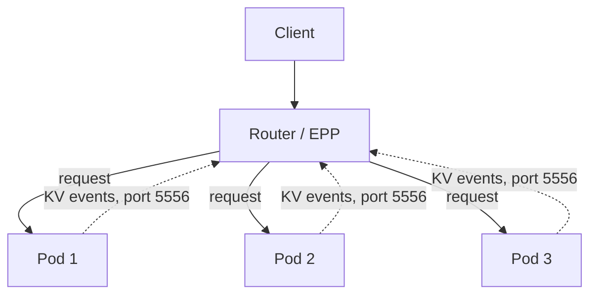
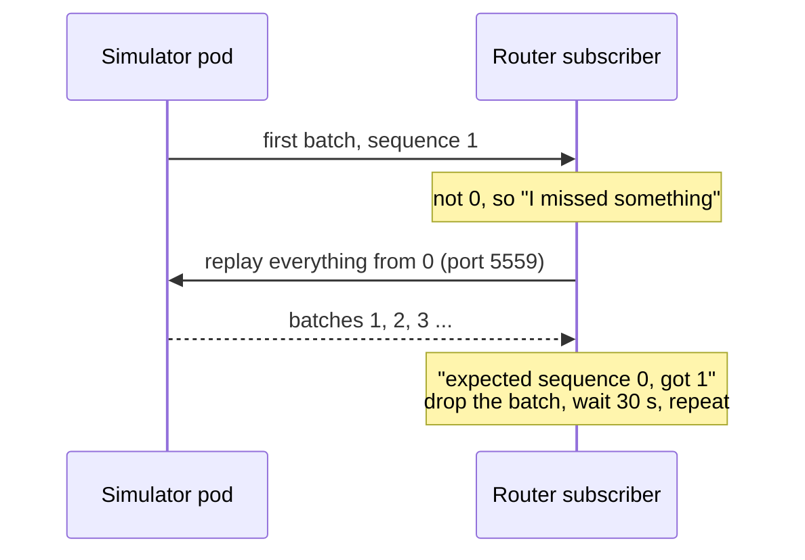
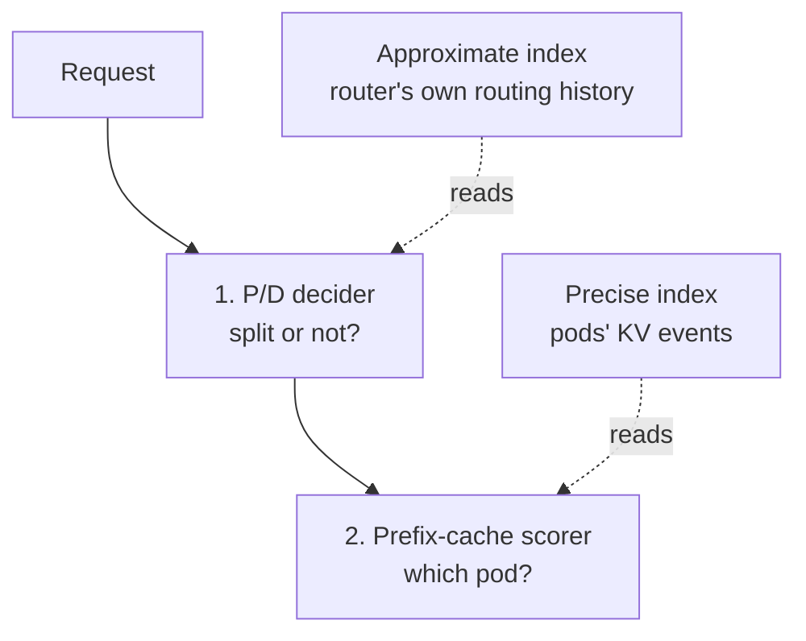

# Precise prefix-cache routing, explained

The plain-language version of why precise routing did not work in this lab, what was
wrong, what fixing it changed, and what was reported upstream. The full evidence, log lines
and source links are in [epp-scheduling.md](epp-scheduling.md); the measurements are in
[bench/README.md](../bench/README.md). This page links to both instead of repeating them.

*Status as of 2026-09-25.*

---

## The cast

**vLLM** is the inference engine: the program that runs the model. In a real llm-d
deployment every model-server pod is a vLLM process on a GPU, and it is responsible for:

1. **Serving the API** — OpenAI-compatible endpoints such as `/v1/chat/completions`.
2. **Running the model** in two phases. **Prefill** processes the whole prompt in one
   parallel pass (compute-bound). **Decode** generates the answer one token at a time
   (memory-bandwidth-bound).
3. **Managing the KV cache.** Prefill produces intermediate results for every prompt token.
   vLLM keeps them in fixed-size **blocks** (64 tokens here) and evicts old blocks when
   memory fills.
4. **Prefix caching.** A prompt that starts like an earlier one — the same system prompt,
   say — reuses the cached blocks instead of recomputing them. The saving only happens if
   the request reaches **the pod that holds those blocks**, which is why routing matters.
5. **Publishing KV events.** Every time it stores or evicts blocks it announces
   `BlockStored` / `BlockRemoved` on a ZMQ socket, each batch numbered **0, 1, 2, …**, and
   keeps a replay buffer of recent batches for subscribers that join late.
6. **Reporting metrics** on `/metrics`: queue depth, cache usage, hit counters.
7. **In P/D setups**, shipping the KV cache from the prefill pod to the decode pod.

**llm-d-inference-sim** is a stand-in for vLLM. It imitates all of the above from the
outside — the same API, metric names, cache bookkeeping and KV events, plus simulated
latency — but runs no model and needs no GPU. That is what lets this lab run on CPU-only
VMs. It also means that wherever the simulator behaves differently from vLLM, whatever is
tested against it can fail in ways real vLLM would not.

The one real vLLM process here is the `render` pod (`vllm launch render`): a tokenizer only,
no weights, so the simulators and the router turn text into the same token IDs.

**The router (EPP)**, from llm-d-router, picks a pod for every request. It keeps an index of
which pod holds which cached blocks, and it can build that index two ways:

| | approximate producer | precise producer |
|---|---|---|
| Built from | the router's own past routing decisions ("I sent this prefix to pod B") | the pods' own KV events |
| Knows about evictions | no | yes (`BlockRemoved`) |
| After a router restart | empty; relearns from traffic | rebuilt from each pod's replay socket |
| Latency | instant | about 1 s behind (the simulator flushes events every second) |

"Precise routing" means the second column. It is what this lab set out to measure.

## How precise routing is supposed to work

Each pod reports what it caches; the router routes a repeated prompt back to the pod that
reported it.

## Defect 1 — nobody opens the door ([#735](https://github.com/llm-d/llm-d-inference-sim/issues/735))

The released simulator, **v0.11.2**, tries to *connect out* on port 5556 instead of
*listening* on it. The router also connects, to each pod. Both sides knock; nobody opens
the door; no event is ever delivered. The port probe showed it: `5556 -> 111`, connection
refused.

Fixed on the simulator's `main` by [PR #668](https://github.com/llm-d/llm-d-inference-sim/pull/668):
an endpoint with a wildcard, like `tcp://*:5556`, now listens. **Not in any release yet.**

## Defect 2 — the page numbers start at 1 ([#736](https://github.com/llm-d/llm-d-inference-sim/issues/736))

With #668 the door opens and events arrive — and the router throws every one of them away.
Each batch of events carries a sequence number, like a page number. vLLM starts at 0. **The
simulator starts at 1.** The router, when a replay socket is configured (port 5559 here),
only accepts a stream that starts at 0:

Every batch meets the same end, so the router's index stays empty and every pod scores 0.
Precise routing silently becomes random routing.

**The fix** is one line in the simulator's `pkg/common/publisher.go`, so numbering starts at
0 as in vLLM, plus updated expectations in five test files. The simulator side is the right
place for it: the router's rule matches real vLLM, and the simulator's job is to imitate
vLLM.

**It only bites with a replay socket.** Without `replaySocketPort` the router accepts any
numbering — but then a restarted router cannot rebuild its index from the pods.

## Why nobody noticed

Every layer reported success. The config parsed, the port was open (after #668), six
subscribers connected, the simulators published events, the scorer ran. The only number
that told the truth was the routing score, stuck at 0. The lesson this lab keeps relearning:
**find a number that only moves if the work actually happened, and watch that.**

## What fixing it bought, measured

Against llm-d-router v0.10.0, with a simulator built from `main` plus the one-line fix:

- **Restart survival — the categorical win.** Restart only the router, then send a prompt
  it had seen before. Precise found the right pod **5 of 5** times; approximate managed
  **1 of 5**, about chance with three pods (measured on v0.11.2, which makes no difference to
  it: the approximate producer never reads the events). The approximate index dies with the
  router; the precise one is rebuilt from the pods. Without the fix, precise managed 2 of 8.
- **Steady-state hit ratio — a tie.** On this workload precise and approximate land within
  about a point of each other. Which one is ahead depends on P/D (next section).
- **Under load**: no sequence errors and no failed subscriber connections in any precise
  run.

The same fix, retested against router **v0.11.0-rc.2**, gave the same results: the rc keeps
the same sequence rule, so the fix is still needed there.

## The P/D "hybrid"

With P/D on, the router makes **two decisions** for every request, in two different plugins:

1. **Split or not?** — the **P/D decider** chooses whether to prefill on a separate pod,
   based on how much of the prompt it believes is already cached.
2. **Which pod?** — the **prefix-cache scorer** favours pods holding the prompt's prefix.

In this lab's precise configuration the scorer reads the precise index, but **the decider
cannot**: in router v0.10.0 it has no setting for where its cache information comes from, so
the router quietly creates an approximate index just for it. One request, two views of the
cache:

**How the two views disagree.** These pods' caches are tiny — 16 blocks, about two
prompts — so blocks are evicted constantly. The router sent a user's prompt to pod B a few
seconds ago; the approximate index still says "B has it", but B has already evicted it, and
the precise index knows so from B's `BlockRemoved` events. The decider decides as if the
prefix were cached; the scorer places by what is really cached.

**What the measurements show.** In each mode the arms differ in one thing, which index the
scorer reads:

| mode | approximate arm | precise arm | ahead |
|---|---|---|---|
| P/D on | consistent (approximate everywhere) | **hybrid** (precise scorer, approximate decider) | approximate, by 0.55 points |
| P/D off | consistent | consistent (precise everywhere) | precise, by 0.37 points |

The lead changes sides exactly when the mixing goes away. That is the evidence for "the
hybrid costs precise about half a point".

**How sure to be:** it is the best explanation available, not a proven mechanism. Both gaps
are under a point and rest on small samples (p ≈ 0.03 and p ≈ 0.06). Proving it would take
watching individual requests where the decider and the scorer disagree, which v0.10.0 does
not log. It cannot be fixed by configuration on v0.10.0 either: the decider's data source is
fixed in code ([epp-scheduling.md](epp-scheduling.md#precise-routing-reaches-the-scorer-and-cannot-reach-the-pd-decider)).

## Known limits

- **The replay window is bounded.** Replay from 0 only works while a pod still holds batch 0.
  The simulator keeps the last 1024 batches (vLLM keeps 10,000); past that, a restarted
  router cannot rebuild its index from that pod until the pod restarts. This is on the
  router side, affects vLLM the same way, and is what
  [llm-d-router#2946](https://github.com/llm-d/llm-d-router/pull/2946) addresses. The 5 of 5
  above was measured on young pods.
- **This lab runs an unreleased simulator image** (`pr668-seq0`, built locally). The build
  steps are in [epp-scheduling.md](epp-scheduling.md#the-image-this-lab-runs); replace it
  with a release once one carries both fixes.

## Upstream contributions

Both defects were found in this lab and reported upstream by the lab's author
([@igfurlan](https://github.com/igfurlan)):

| what | link | status |
|---|---|---|
| Issue: v0.11.2 never binds the KV-events port (defect 1) | [llm-d-inference-sim#735](https://github.com/llm-d/llm-d-inference-sim/issues/735) | open; fixed on `main` by #668, awaiting a release. A follow-up comment reports that #668 works and that a release also needs the #736 fix |
| Issue: sequence numbers start at 1 (defect 2) | [llm-d-inference-sim#736](https://github.com/llm-d/llm-d-inference-sim/issues/736) | open, awaiting maintainer triage |
| Fix for #736 | branch [`fix/kv-events-seq-starts-at-zero`](https://github.com/igfurlan/llm-d-inference-sim/tree/fix/kv-events-seq-starts-at-zero) on the author's fork | ready: two signed, signed-off commits; project CI and `make presubmit` pass; verified on this cluster against router v0.10.0 and v0.11.0-rc.2 |
| Pull request for the fix | — | **not opened yet.** The project asks for agreement on an issue before a PR; #736 asks whether 1-based numbering is intentional, and the PR follows the answer |

Update this table as they move.
